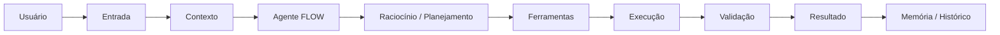
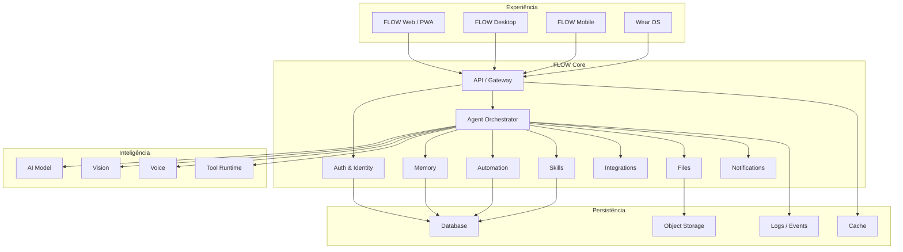
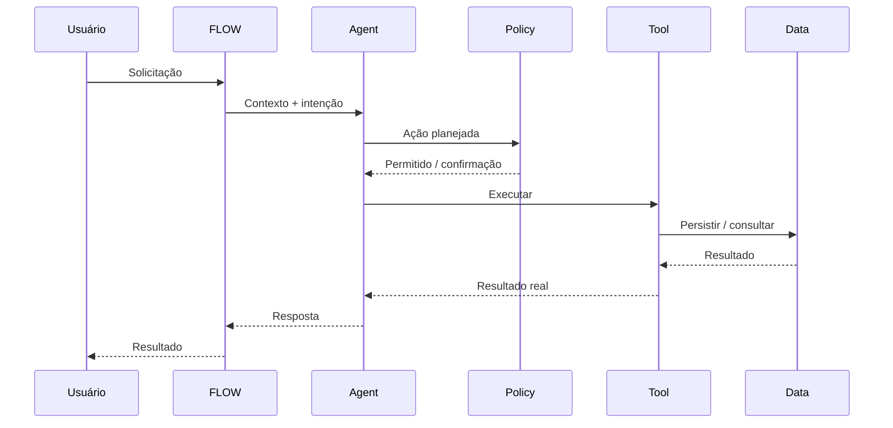

<div align="center">

# FLOW AI

### Sua inteligência pessoal que conversa, entende e age.

**Assistente pessoal multimodal • automação • memória • voz • visão • integrações • agentes**

<br />

[](./docs)
[](./docs)
[](./LICENSE)

<br />

> **FLOW não foi pensada para apenas responder.**
> A proposta é compreender contexto, utilizar ferramentas, executar ações autorizadas e aprender com o uso.

</div>

---

## ✦ Navegação

<details open>
<summary><strong>Mapa rápido</strong></summary>

- [Sobre o projeto](#-sobre-o-projeto)
- [Visão do produto](#-visão-do-produto)
- [Capacidades](#-capacidades)
- [Arquitetura](#-arquitetura)
- [Fluxo de execução](#-fluxo-de-execução)
- [Estrutura do repositório](#-estrutura-do-repositório)
- [Stack](#-stack)
- [Pré-requisitos](#-pré-requisitos)
- [Configuração](#-configuração)
- [Executando localmente](#-executando-localmente)
- [Integrações](#-integrações)
- [IA, ferramentas e agentes](#-ia-ferramentas-e-agentes)
- [Segurança e permissões](#-segurança-e-permissões)
- [Estado do produto](#-estado-do-produto)
- [Desenvolvimento](#-desenvolvimento)
- [Testes e validação](#-testes-e-validação)
- [Documentação](#-documentação)
- [Contribuição](#-contribuição)
- [Licença](#-licença)

</details>

---

## ◈ Sobre o projeto

A **FLOW AI** é uma plataforma de inteligência pessoal orientada a contexto e execução.

Em vez de limitar a experiência a uma conversa com um modelo, a arquitetura foi pensada para conectar:

- conversação;
- voz;
- visão;
- memória;
- arquivos;
- rotinas;
- automações;
- dispositivos;
- integrações externas;
- ferramentas;
- habilidades;
- dados pessoais;
- permissões;
- modelos de IA.

A experiência central é simples:

```text
ENTENDER → DECIDIR → CONFIRMAR QUANDO NECESSÁRIO → EXECUTAR → VALIDAR → APRENDER
```

A FLOW deve saber diferenciar uma resposta informativa de uma ação que altera dados, utiliza uma integração ou produz um efeito externo.

---

## ◎ Visão do produto

A FLOW é organizada ao redor de um princípio:

> **A inteligência precisa estar conectada ao contexto e às ferramentas do usuário.**

Isso transforma o assistente em uma camada de orquestração entre o usuário, seus dados, seus dispositivos e serviços externos.

### Experiência



### Modalidades

| Modalidade | Função |
|---|---|
| 💬 Chat | Conversação contextual |
| 🎙️ Voz | Entrada e saída por voz |
| 👁️ Visão | Interpretação de imagens e contexto visual |
| 🧠 Memória | Persistência de informações autorizadas |
| 📁 Arquivos | Upload, organização e consulta |
| ⚡ Automação | Rotinas, timers e ações |
| 🏠 Dispositivos | Casa inteligente e dispositivos conectados |
| 🔌 Integrações | Serviços externos |
| 🧩 Skills | Capacidades instaláveis e executáveis |
| 🛠️ API | Integração programática |

---

## ✨ Capacidades

<details>
<summary><strong>💬 Conversação</strong></summary>

- Nova conversa
- Conversas em andamento
- Histórico
- Pesquisa
- Arquivamento
- Exclusão
- Compartilhamento
- Exportação
- Anexos
- Imagens
- PDFs
- Visão
- Resultados de ferramentas
- Confirmação de ações
- Regeneração
- Continuação
- Feedback
- Estados offline e erro

</details>

<details>
<summary><strong>🎙️ Voz</strong></summary>

- Ativação
- Listening
- Processamento
- Resposta
- Wake Word
- Microfone
- TTS
- Dispositivos autorizados
- Diagnóstico
- Histórico
- Privacidade
- Estados de permissão

</details>

<details>
<summary><strong>⚡ Rotinas e automações</strong></summary>

- Criar
- Editar
- Duplicar
- Pausar
- Ativar
- Executar
- Testar
- Condições
- Gatilhos
- Ações
- Recorrência
- Histórico
- Falhas
- Integrações
- Dispositivos

</details>

<details>
<summary><strong>🧠 Memória</strong></summary>

- Memórias pessoais
- Categorias
- Pesquisa
- Filtros
- Edição
- Exclusão
- Importação
- Exportação
- Controle de memória
- Dados protegidos
- Histórico

</details>

<details>
<summary><strong>🔌 Integrações</strong></summary>

A arquitetura prevê integrações com serviços como:

- WhatsApp
- Instagram
- Gmail
- Google Calendar
- Google Drive
- Microsoft
- Discord
- Slack
- Spotify
- Wear OS
- Serviços de casa inteligente

Cada integração deve possuir ciclo próprio de conexão, autorização, configuração, sincronização, falha e desconexão.

</details>

<details>
<summary><strong>🧩 Skills</strong></summary>

O sistema de Skills foi projetado para permitir capacidades modulares:

```text
Marketplace
   ↓
Pesquisa
   ↓
Detalhes
   ↓
Instalação
   ↓
Permissões
   ↓
Execução
   ↓
Resultado
   ↓
Logs
```

Uma Skill não deve ser apenas uma página visual. Ela precisa possuir contrato, permissões, execução e tratamento de erros.

</details>

---

## 🏗️ Arquitetura

A arquitetura segue uma separação por responsabilidades.



### Regra arquitetural

Nenhuma camada deve assumir responsabilidade de outra camada sem necessidade.

```text
Interface
   ↓
Application / Use Case
   ↓
Domain
   ↓
Infrastructure
   ↓
External Services / Database
```

A implementação concreta do repositório pode variar conforme o estado atual do projeto, mas a separação de responsabilidades deve ser preservada.

---

## 🔄 Fluxo de execução

O ciclo operacional da FLOW segue:

```text
LER
 ↓
INSPECIONAR
 ↓
LOCALIZAR
 ↓
PLANEJAR
 ↓
EXECUTAR
 ↓
TESTAR
 ↓
AUDITAR
 ↓
DOCUMENTAR
```

### Exemplo

```text
Usuário:
"Crie uma rotina para me lembrar de estudar às 20h."

        ↓

FLOW interpreta a intenção

        ↓

Verifica contexto e permissões

        ↓

Planeja a rotina

        ↓

Solicita confirmação quando necessário

        ↓

Cria a rotina

        ↓

Persiste no banco

        ↓

Agenda a execução

        ↓

Valida o resultado

        ↓

Retorna confirmação ao usuário
```

A FLOW **não deve declarar uma ação como executada sem que a execução realmente tenha ocorrido**.

---

## 🧱 Estrutura do repositório

> A estrutura abaixo representa a organização arquitetural esperada. Os diretórios reais do projeto são a fonte de verdade para implementação.

```text
flow-assistente-ai/
│
├── frontend/                 # Experiência web / PWA
│   ├── src/
│   ├── public/
│   └── ...
│
├── backend/                  # API e regras de negócio
│   ├── ...
│   └── ...
│
├── docs/                     # Documentação técnica e produto
│   ├── FLOW AI INVENTÁRIO COMPLETO.txt
│   ├── FLOW_AI_API_CONTRACT.md
│   ├── FLOW_AI_BACKEND_*.md
│   └── ...
│
├── infrastructure/           # Infraestrutura e ambiente
│
├── flow-ai-desktop/          # Desktop
│
├── flow-ai-ios/              # iOS
│
├── flow-ai-android/          # Android
│
├── models-tela/              # Referências visuais
│
├── .env.example
├── README.md
└── LICENSE
```

---

## 🧰 Stack

A stack deve ser lida a partir do código e dos arquivos de lock/configuração do projeto. Abaixo está o mapa arquitetural adotado pelo projeto:

### Frontend

- React
- Next.js / Vite conforme o aplicativo específico
- TypeScript / JavaScript conforme o módulo existente
- Tailwind CSS
- Lucide
- Framer Motion
- Zustand
- React Hook Form
- Zod
- React Query

### Backend

- Node.js para serviços de aplicação
- Python para serviços especializados de IA, voz e visão
- APIs HTTP
- WebSockets quando necessários
- PostgreSQL
- Redis quando necessário

### IA

- Modelos locais e/ou externos conforme ambiente
- Ollama
- NVIDIA NIM quando disponível
- Vision
- Speech-to-Text
- Text-to-Speech
- Tool calling
- Agent orchestration

### Desenvolvimento

- Git
- GitHub
- Docker
- Ubuntu
- OpenCode
- MCP
- Playwright

---

## 🚀 Pré-requisitos

Antes de iniciar o ambiente local, tenha instalado:

- Git
- Node.js
- npm/pnpm/yarn conforme o lockfile do projeto
- Python
- ambiente virtual Python quando aplicável
- Docker, quando requerido
- PostgreSQL ou infraestrutura equivalente
- Redis quando requerido
- Ollama quando o ambiente local de IA for utilizado

Verifique as versões efetivamente suportadas pelos arquivos:

```text
package.json
package-lock.json / pnpm-lock.yaml / yarn.lock
pyproject.toml
requirements.txt
Dockerfile
docker-compose.yml
```

**Não atualize versões automaticamente apenas para "modernizar" o projeto.**

Compatibilidade deve ser validada antes.

---

## ⚙️ Configuração

Crie o ambiente a partir do exemplo:

```bash
cp .env.example .env
```

Nunca versionar:

```text
.env
.env.local
.env.production
*.pem
*.key
tokens
API keys
senhas
credenciais
```

### Variáveis de ambiente

Exemplo conceitual:

```env
NODE_ENV=development

DATABASE_URL=
REDIS_URL=

API_URL=
FRONTEND_URL=

JWT_SECRET=

OPENAI_API_KEY=
NVIDIA_API_KEY=

GOOGLE_CLIENT_ID=
GOOGLE_CLIENT_SECRET=

WHATSAPP_ACCESS_TOKEN=
INSTAGRAM_ACCESS_TOKEN=
```

> Os nomes reais devem seguir os arquivos de configuração do projeto. Não invente variáveis apenas porque aparecem neste README.

---

## ▶️ Executando localmente

### 1. Instalar dependências

```bash
npm install
```

ou o gerenciador definido pelo projeto.

### 2. Preparar backend

```bash
# utilize o comando definido pelo backend atual
```

### 3. Preparar banco

```bash
# execute somente as migrations definidas pelo projeto
```

### 4. Iniciar desenvolvimento

```bash
npm run dev
```

Se frontend e backend forem serviços separados:

```bash
# terminal 1
<backend-command>

# terminal 2
<frontend-command>
```

### 5. Verificar saúde

Quando houver endpoint de health check:

```bash
curl http://localhost:<PORT>/api/health
```

Resultado esperado deve refletir o contrato real da aplicação.

---

## 🔌 Integrações

As integrações seguem um ciclo comum:

```text
DISCOVER
   ↓
CONNECT
   ↓
AUTHORIZE
   ↓
STORE SECURELY
   ↓
SYNC
   ↓
USE
   ↓
REFRESH
   ↓
DISCONNECT
```

Cada integração deve tratar:

- autorização;
- tokens;
- refresh;
- expiração;
- permissões;
- sincronização;
- rate limits;
- erros;
- indisponibilidade;
- logs;
- revogação.

Credenciais externas nunca devem ser expostas ao frontend.

---

## 🧠 IA, ferramentas e agentes

A FLOW separa inteligência de autoridade.

O modelo pode:

- interpretar;
- planejar;
- sugerir;
- selecionar ferramentas;
- produzir argumentos;
- explicar resultados.

Mas a camada de execução deve:

- validar permissões;
- validar argumentos;
- validar contexto;
- executar a ferramenta;
- registrar o resultado;
- devolver o resultado ao agente.



### Regra crítica

```text
Modelo ≠ autoridade
```

A autorização pertence ao sistema, não ao modelo.

---

## 🔐 Segurança e permissões

A segurança é transversal.

### Princípios

- menor privilégio;
- autenticação obrigatória;
- autorização no backend;
- isolamento de dados por usuário;
- secrets fora do código;
- validação de entrada;
- auditoria de ações;
- expiração de sessão;
- revogação;
- logs;
- proteção de integrações.

### Desenvolvedor

A área **Developer / API** pode ser controlada por permissão.

O frontend pode ocultar a categoria para usuários não autorizados, mas:

> **ocultar no frontend nunca substitui autorização no backend.**

---

## 🧪 Testes e validação

A FLOW deve ser validada em múltiplas camadas.

### Build

```bash
npm run build
```

### Testes unitários

```bash
npm test
```

### Testes de API

Validar:

- status code;
- payload;
- autenticação;
- autorização;
- erros;
- persistência.

### Testes de navegador

Com Playwright:

```text
abrir
→ navegar
→ clicar
→ preencher
→ executar
→ validar
→ capturar estado
→ corrigir
→ repetir
```

### Checklist operacional

- [ ] Build sem erros
- [ ] Backend inicia
- [ ] Frontend inicia
- [ ] Banco disponível
- [ ] Autenticação funciona
- [ ] Rotas principais funcionam
- [ ] APIs respondem
- [ ] Sem erros críticos no console
- [ ] Sem endpoints fake
- [ ] Sem dados fake em fluxos reais
- [ ] Permissões verificadas
- [ ] Responsividade validada
- [ ] Fluxos críticos testados

---

## 📊 Estado do produto

O inventário oficial do produto está em:

[`docs/FLOW AI INVENTÁRIO COMPLETO.txt`](./docs/FLOW%20AI%20INVENT%C3%81RIO%20COMPLETO.txt)

Ele funciona como referência de escopo para:

- páginas;
- rotas;
- funcionalidades;
- componentes;
- estados;
- integrações;
- permissões;
- experiências especiais.

### Regra de status

| Status | Significado |
|---|---|
| 🟢 | Implementado e funcional |
| 🟡 | Implementado parcialmente |
| 🟠 | Interface existe, mas funcionalidade está ausente |
| 🔴 | Não implementado |
| 🟣 | Mock / simulação |
| ⚫ | Não testável no ambiente atual |

Um item só deve ser considerado **🟢** quando o fluxo real tiver sido implementado e validado.

---

## 🗺️ Roadmap

<details>
<summary><strong>Fase 01 — Fundação</strong></summary>

- [ ] Frontend estável
- [ ] Backend estável
- [ ] Banco
- [ ] Autenticação
- [ ] Sessões
- [ ] Permissões
- [ ] API base
- [ ] Observabilidade

</details>

<details>
<summary><strong>Fase 02 — Core Experience</strong></summary>

- [ ] Dashboard
- [ ] Chat
- [ ] Voz
- [ ] Memória
- [ ] Arquivos
- [ ] Rotinas
- [ ] Timers
- [ ] Notificações

</details>

<details>
<summary><strong>Fase 03 — Inteligência</strong></summary>

- [ ] Agent orchestration
- [ ] Tool calling
- [ ] Vision
- [ ] TTS
- [ ] STT
- [ ] Wake Word
- [ ] Context management
- [ ] Memory system

</details>

<details>
<summary><strong>Fase 04 — Ecossistema</strong></summary>

- [ ] Integrações
- [ ] Skills
- [ ] Smart Home
- [ ] Wear OS
- [ ] API pública
- [ ] Webhooks
- [ ] SDKs

</details>

<details>
<summary><strong>Fase 05 — Plataforma</strong></summary>

- [ ] Planos
- [ ] Assinaturas
- [ ] Pagamentos
- [ ] Uso e consumo
- [ ] Suporte
- [ ] Privacidade
- [ ] Exportação
- [ ] Exclusão de dados

</details>

---

## 🧭 Convenções de desenvolvimento

### Código

Prefira:

```text
pequenas responsabilidades
↓
interfaces claras
↓
dependências explícitas
↓
testabilidade
↓
observabilidade
```

Evite:

```text
componente gigante
+
regra de negócio na UI
+
API direta em componente
+
dados mockados
+
estado global sem necessidade
```

### Commits

Use Conventional Commits:

```text
feat: adiciona memória persistente
fix: corrige fluxo de autenticação
refactor: separa serviço de integrações
test: adiciona testes do chat
docs: atualiza arquitetura
chore: atualiza configuração
```

### Branches

Exemplo:

```text
main
develop
feature/*
fix/*
refactor/*
docs/*
```

---

## 🧩 Princípios de engenharia

<details>
<summary><strong>1. Não inventar</strong></summary>

Não inventar:

- endpoints;
- arquivos;
- credenciais;
- integrações;
- testes;
- resultados;
- deploys;
- capacidades de terceiros.

</details>

<details>
<summary><strong>2. Não duplicar</strong></summary>

Antes de criar uma nova implementação:

1. procurar existente;
2. verificar contrato;
3. verificar dependências;
4. reutilizar quando correto;
5. refatorar quando necessário.

</details>

<details>
<summary><strong>3. Segurança antes de conveniência</strong></summary>

Toda ação sensível deve respeitar:

```text
IDENTIDADE
   ↓
PERMISSÃO
   ↓
POLÍTICA
   ↓
EXECUÇÃO
   ↓
AUDITORIA
```

</details>

<details>
<summary><strong>4. Interface não é implementação</strong></summary>

Um botão só é funcional quando possui fluxo real.

Uma página só está concluída quando seus estados e ações principais funcionam.

Um endpoint só está concluído quando possui comportamento real e validado.

</details>

---

## 📚 Documentação

A documentação técnica complementar fica em:

```text
docs/
```

Principais referências:

| Documento | Finalidade |
|---|---|
| `FLOW AI INVENTÁRIO COMPLETO.txt` | Escopo funcional |
| `FLOW_AI_API_CONTRACT.md` | Contratos de API |
| `FLOW_AI_BACKEND_DJANGO.md` | Referência de backend |
| `FLOW_AI_BACKEND_PYTHON.md` | Serviços Python |
| `FLOW_AI_REGRA_FINAL_LAYOUT_RESPONSIVO_E_DIMENSOES.md` | Layout e responsividade |
| `FLOW_AI_REGRA_FINAL_MENU_E_ACESSO_DESENVOLVEDOR.md` | Controle de acesso Developer |
| `FLOW_AI_REGRA_FINAL_SEPARACAO_APP_SITE.md` | Separação entre produto e site |
| `FLOW_AI_AUDITORIA_FINAL_POS_IMPLEMENTACAO.md` | Auditoria pós-implementação |

---

## 🛠️ Diagnóstico rápido

### O frontend não inicia

```text
1. Verifique dependências.
2. Verifique porta.
3. Verifique variáveis de ambiente.
4. Execute o build.
5. Leia o erro original.
6. Corrija a causa.
```

### A API não responde

```text
1. Backend está executando?
2. Porta está correta?
3. Proxy está correto?
4. Banco está disponível?
5. Autenticação está válida?
6. Logs mostram erro?
```

### A FLOW não executa uma ação

```text
1. A intenção foi identificada?
2. A ferramenta existe?
3. A ferramenta está registrada?
4. O usuário possui permissão?
5. Os argumentos são válidos?
6. O serviço externo está disponível?
7. A execução realmente ocorreu?
8. O resultado foi persistido?
```

---

## 🤝 Contribuição

Antes de abrir uma alteração:

1. Leia a documentação relevante.
2. Entenda a arquitetura existente.
3. Procure implementação semelhante.
4. Defina o impacto.
5. Implemente de forma incremental.
6. Execute testes.
7. Valide no navegador quando aplicável.
8. Atualize documentação quando necessário.

Pull requests devem explicar:

```text
O que mudou?
Por que mudou?
Como foi testado?
Existe impacto em dados?
Existe impacto em API?
Existe impacto em segurança?
```

---

## 📈 Qualidade

A definição de "pronto" para a FLOW é:

```text
IMPLEMENTAR
    ↓
INTEGRAR
    ↓
TESTAR
    ↓
VALIDAR
    ↓
AUDITAR
    ↓
DOCUMENTAR
```

Não consideramos concluído apenas porque:

- a tela abre;
- o botão aparece;
- o build passa;
- existe um endpoint;
- existe um mock.

A conclusão depende do fluxo real.

---

## 🔭 Próximas evoluções

A visão de longo prazo da FLOW inclui uma plataforma capaz de combinar:

```text
MEMÓRIA
+
CONTEXTO
+
MODELOS
+
FERRAMENTAS
+
AUTOMAÇÕES
+
INTEGRAÇÕES
+
DISPOSITIVOS
+
SKILLS
=
INTELIGÊNCIA OPERACIONAL PESSOAL
```

A intenção não é construir apenas mais um chat.

É construir uma camada pessoal de inteligência capaz de **entender, organizar, conectar e agir**, respeitando as permissões e a autonomia do usuário.

---

## 📜 Licença

Este projeto é proprietário.

Consulte [`LICENSE`](./LICENSE) para os termos aplicáveis.

---

<div align="center">

### FLOW AI

**Conecte • Compartilhe • Viva**

<br />

Built with curiosity, engineering and a lot of FLOW.

</div>
