<div align="center">


# FLOW AI

### Sua inteligência pessoal que conversa, entende e age.

**Assistente pessoal multimodal • automação • memória • voz • visão • integrações**


**Construído por Vini Amaral**  
**Flow Serviços Online Ltda.**

</div>

---

## ✦ Navegação

<details open>
<summary><strong>Mapa rápido</strong></summary>

- [Sobre o projeto](#-sobre-o-projeto)
- [Visão do produto](#-visão-do-produto)
- [Capacidades](#-capacidades)
- [Telas e páginas](#-telas-e-páginas)
- [Arquitetura](#-arquitetura)
- [Stack](#-stack)
- [Segurança e permissões](#-segurança-e-permissões)
- [Testes e validação](#-testes-e-validação)
- [Estado do produto](#-estado-do-produto)
- [Documentação](#-documentação)

</details>

---

## ◈ Sobre o projeto

A **FLOW AI** é uma plataforma de inteligência pessoal orientada a contexto e execução. A proposta é ir além de uma conversa com um modelo: a FLOW conecta conversação, voz, visão, memória, arquivos, rotinas, automações, dispositivos, integrações, ferramentas e Skills em uma experiência única.

O README apresenta o produto de forma objetiva para documentação e portfólio. A seção de telas é baseada nas imagens existentes em `moldes-tela/`: **não são adicionadas páginas apenas planejadas quando não existe uma tela correspondente no material visual**.

---

## ◎ Visão do produto

A visão da FLOW é criar uma camada pessoal de inteligência capaz de compreender contexto, organizar informações, utilizar ferramentas e executar ações autorizadas pelo usuário.

```text
ENTENDER → PLANEJAR → CONFIRMAR QUANDO NECESSÁRIO
                     ↓
                   EXECUTAR
                     ↓
                  VALIDAR
                     ↓
                DOCUMENTAR
```

| Modalidade | Função |
|---|---|
| 💬 Chat | Conversação contextual |
| 🎙️ Voz | Entrada e saída por voz |
| 👁️ Visão | Interpretação visual |
| 🧠 Memória | Persistência de informações autorizadas |
| 📁 Arquivos | Organização e consulta |
| ⚡ Automação | Rotinas, timers e ações |
| 🏠 Dispositivos | Casa inteligente |
| 🔌 Integrações | Serviços externos |
| 🧩 Skills | Capacidades modulares |
| 🛠️ API | Integração programática |

---

## ✨ Capacidades

<details>
<summary><strong>💬 Conversação</strong></summary>

Chat, histórico, pesquisa, anexos, imagens, PDFs, visão, resultados de ferramentas, confirmação de ações, exportação, compartilhamento, regeneração, feedback e estados de erro/offline.

</details>

<details>
<summary><strong>🎙️ Voz</strong></summary>

Ativação, processamento, resposta, Wake Word, microfone, TTS, dispositivos autorizados, diagnóstico e privacidade.

</details>

<details>
<summary><strong>⚡ Rotinas e automações</strong></summary>

Criação, edição, execução, gatilhos, condições, ações, recorrência, histórico e tratamento de falhas.

</details>

<details>
<summary><strong>🧠 Memória</strong></summary>

Memórias pessoais, categorias, pesquisa, filtros, edição, exclusão, importação, exportação e controle.

</details>

<details>
<summary><strong>🔌 Integrações</strong></summary>

Conexão, autorização, configuração, sincronização, gerenciamento e revogação de serviços externos.

</details>

<details>
<summary><strong>🧩 Skills</strong></summary>

Descoberta, instalação, permissões, execução e gerenciamento de capacidades adicionais.

</details>

---

## 🖥️ Telas e páginas

A galeria abaixo é a parte principal do README para apresentação do projeto. **Cada categoria pode ser aberta e, dentro dela, cada página também pode ser aberta individualmente.**

Ao abrir uma página, a ordem é: **descrição → funcionalidades → imagem da tela**. As imagens não são incorporadas ao README; são arquivos independentes da pasta `moldes-tela/` e são referenciadas por caminho relativo.

> **Critério:** entram aqui somente telas identificáveis no material visual disponível. Estados genéricos, arquivos sem identificação de página e imagens usadas apenas como banner/arte de apoio não são tratados como páginas.

<details>
<summary><strong>🔐 Autenticação</strong> — 5 páginas</summary>

<details>
<summary><strong>Login</strong></summary>

**O que esta página faz**

É a porta de entrada da aplicação, concentrando a autenticação do usuário antes do acesso ao ambiente FLOW.

**Funcionalidades representadas**

- Entrada na conta
- Autenticação
- Acesso à recuperação de senha

**Visual da tela**

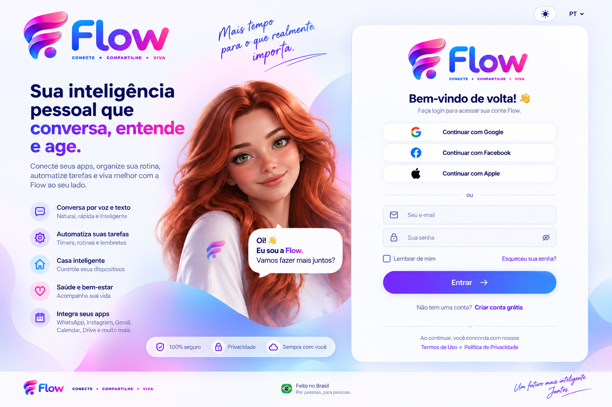

</details>

<details>
<summary><strong>Criar conta</strong></summary>

**O que esta página faz**

Inicia o cadastro de uma nova conta FLOW AI e prepara o usuário para as próximas etapas de configuração.

**Funcionalidades representadas**

- Cadastro
- Dados iniciais
- Continuação do onboarding

**Visual da tela**

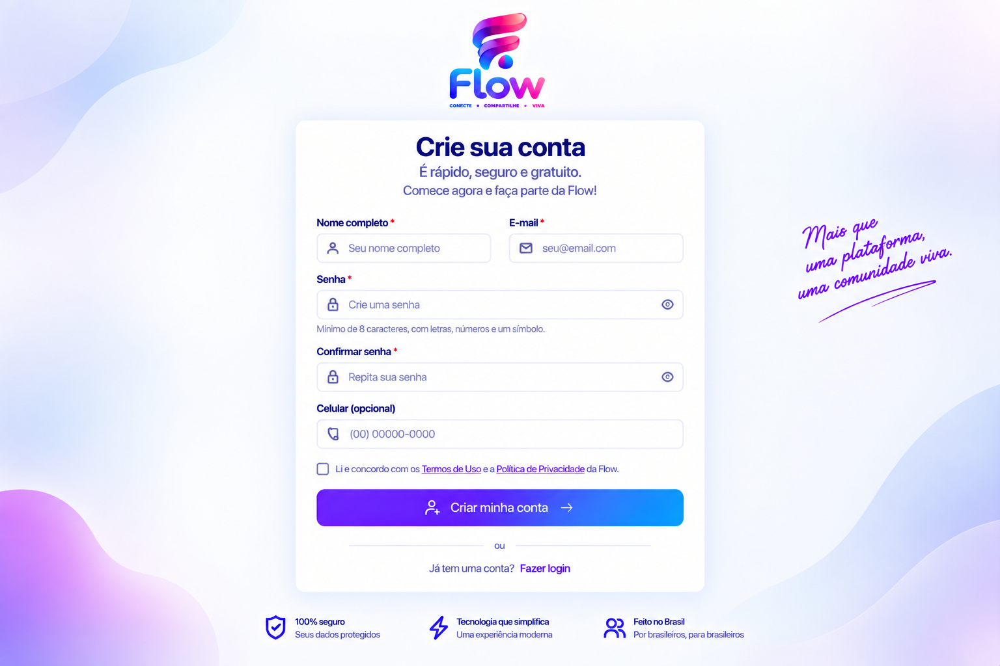

</details>

<details>
<summary><strong>Confirmação de e-mail</strong></summary>

**O que esta página faz**

Valida o endereço de e-mail informado no cadastro antes da liberação das próximas etapas.

**Funcionalidades representadas**

- Validação de e-mail
- Confirmação da conta
- Continuação do cadastro

**Visual da tela**


</details>

<details>
<summary><strong>Redefinir senha</strong></summary>

**O que esta página faz**

Inicia o processo de recuperação de acesso para quem não consegue utilizar a senha atual.

**Funcionalidades representadas**

- Recuperação de acesso
- Solicitação de redefinição
- Retorno ao login

**Visual da tela**


</details>

<details>
<summary><strong>Criar nova senha</strong></summary>

**O que esta página faz**

Permite definir a nova credencial depois que o processo de recuperação foi iniciado.

**Funcionalidades representadas**

- Nova senha
- Confirmação da senha
- Conclusão da recuperação

**Visual da tela**

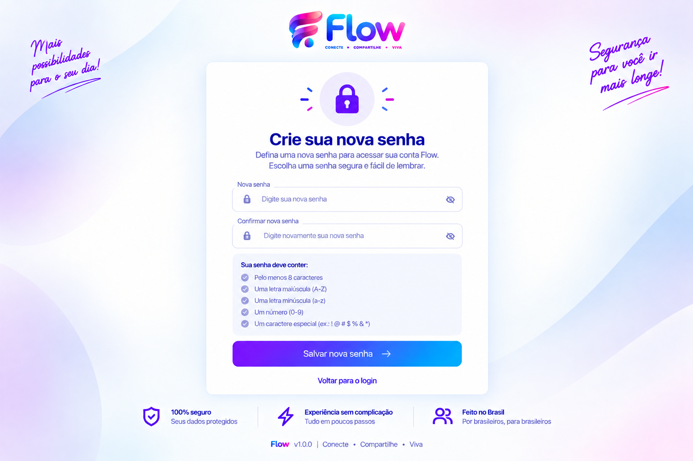

</details>

</details>

<details>
<summary><strong>🏠 Dashboard e experiência principal</strong> — 4 páginas</summary>

<details>
<summary><strong>Home</strong></summary>

**O que esta página faz**

É a área principal da experiência autenticada, reunindo o contexto da conta e os caminhos mais importantes da FLOW.

**Funcionalidades representadas**

- Visão geral
- Ações rápidas
- Acesso às principais áreas

**Visual da tela**

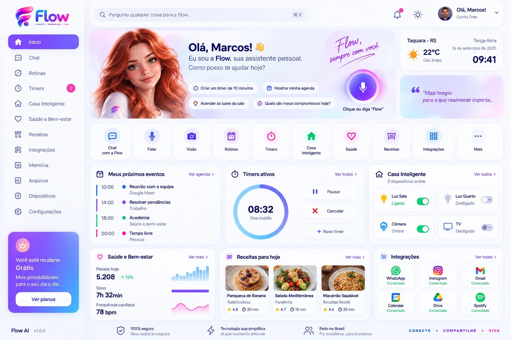

</details>

<details>
<summary><strong>Chat</strong></summary>

**O que esta página faz**

Apresenta a experiência central de interação com a FLOW por conversa.

**Funcionalidades representadas**

- Conversação
- Entrada de mensagens
- Acesso à inteligência da FLOW

**Visual da tela**

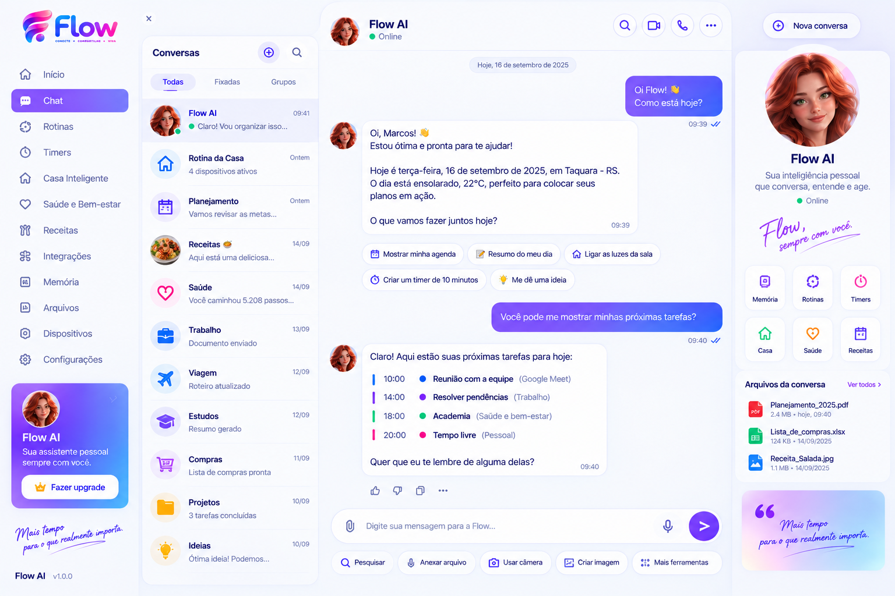

</details>

<details>
<summary><strong>Status do FLOW</strong></summary>

**O que esta página faz**

Exibe o estado atual da assistente durante a experiência, ajudando o usuário a compreender quando ela está ativa ou processando.

**Funcionalidades representadas**

- Estado da FLOW
- Processamento
- Indicação de atividade

**Visual da tela**


</details>

<details>
<summary><strong>Perfil do FLOW AI</strong></summary>

**O que esta página faz**

Apresenta a identidade da assistente e o contexto visual da FLOW dentro do produto.

**Funcionalidades representadas**

- Identidade da FLOW
- Informações da assistente
- Acesso às configurações relacionadas

**Visual da tela**


</details>

</details>

<details>
<summary><strong>💬 Chat</strong> — 4 páginas</summary>

<details>
<summary><strong>Nova conversa</strong></summary>

**O que esta página faz**

Inicia uma nova conversa e prepara a interface para uma nova interação contextual.

**Funcionalidades representadas**

- Nova conversa
- Campo de mensagem
- Ações da conversa

**Visual da tela**


</details>

<details>
<summary><strong>Conversa em andamento</strong></summary>

**O que esta página faz**

Representa uma conversa ativa, mantendo as mensagens e o contexto da interação com a FLOW.

**Funcionalidades representadas**

- Mensagens
- Contexto
- Interação contínua

**Visual da tela**


</details>

<details>
<summary><strong>Detalhes da conversa</strong></summary>

**O que esta página faz**

Concentra as informações e ações relacionadas a uma conversa específica.

**Funcionalidades representadas**

- Informações da conversa
- Ações de gerenciamento
- Detalhes

**Visual da tela**


</details>

<details>
<summary><strong>Pesquisa de conversas</strong></summary>

**O que esta página faz**

Permite localizar uma conversa anterior dentro do histórico.

**Funcionalidades representadas**

- Pesquisa
- Resultados
- Acesso ao histórico

**Visual da tela**


</details>

</details>

<details>
<summary><strong>🎙️ Voz e Wake Word</strong> — 6 páginas</summary>

<details>
<summary><strong>Voz e Wake Word</strong></summary>

**O que esta página faz**

Centraliza a experiência e as configurações relacionadas à interação por voz e à palavra de ativação da FLOW.

**Funcionalidades representadas**

- Voz
- Wake Word
- Preferências de interação

**Visual da tela**


</details>

<details>
<summary><strong>Microfone e permissões de voz</strong></summary>

**O que esta página faz**

Controla o acesso ao microfone necessário para os recursos de voz.

**Funcionalidades representadas**

- Permissão do microfone
- Estado do acesso
- Configuração

**Visual da tela**


</details>

<details>
<summary><strong>Treinar Wake Word “Flow”</strong></summary>

**O que esta página faz**

Fluxo destinado ao treinamento da palavra de ativação da assistente.

**Funcionalidades representadas**

- Treinamento
- Captura de voz
- Configuração da Wake Word

**Visual da tela**


</details>

<details>
<summary><strong>Dispositivos de voz autorizados</strong></summary>

**O que esta página faz**

Lista os dispositivos que possuem autorização para utilizar recursos de voz.

**Funcionalidades representadas**

- Dispositivos autorizados
- Gerenciamento
- Controle de acesso

**Visual da tela**


</details>

<details>
<summary><strong>Diagnóstico de voz e microfone</strong></summary>

**O que esta página faz**

Permite verificar o funcionamento dos recursos de voz e do microfone.

**Funcionalidades representadas**

- Diagnóstico
- Microfone
- Estado dos recursos

**Visual da tela**


</details>

<details>
<summary><strong>Privacidade da voz e dados de áudio</strong></summary>

**O que esta página faz**

Centraliza controles sobre privacidade e tratamento dos dados de áudio.

**Funcionalidades representadas**

- Privacidade
- Dados de áudio
- Preferências

**Visual da tela**


</details>

</details>

<details>
<summary><strong>⚡ Rotinas e automações</strong> — 6 páginas</summary>

<details>
<summary><strong>Rotinas</strong></summary>

**O que esta página faz**

Área de gerenciamento das rotinas automatizadas criadas para a FLOW.

**Funcionalidades representadas**

- Listagem
- Status
- Gerenciamento

**Visual da tela**

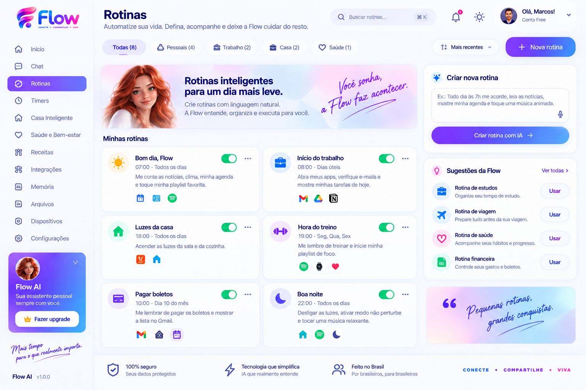

</details>

<details>
<summary><strong>Criar rotina</strong></summary>

**O que esta página faz**

Permite configurar uma nova rotina automatizada.

**Funcionalidades representadas**

- Criação
- Configuração
- Ações da rotina

**Visual da tela**


</details>

<details>
<summary><strong>Editar rotina</strong></summary>

**O que esta página faz**

Permite alterar uma rotina existente sem recriá-la.

**Funcionalidades representadas**

- Edição
- Atualização
- Configuração

**Visual da tela**


</details>

<details>
<summary><strong>Detalhes da rotina</strong></summary>

**O que esta página faz**

Apresenta o funcionamento e as configurações de uma rotina específica.

**Funcionalidades representadas**

- Detalhes
- Configurações
- Ações

**Visual da tela**


</details>

<details>
<summary><strong>Automações e Skills</strong></summary>

**O que esta página faz**

Reúne a visão de automações e capacidades adicionais disponíveis na FLOW.

**Funcionalidades representadas**

- Automações
- Skills
- Gerenciamento

**Visual da tela**

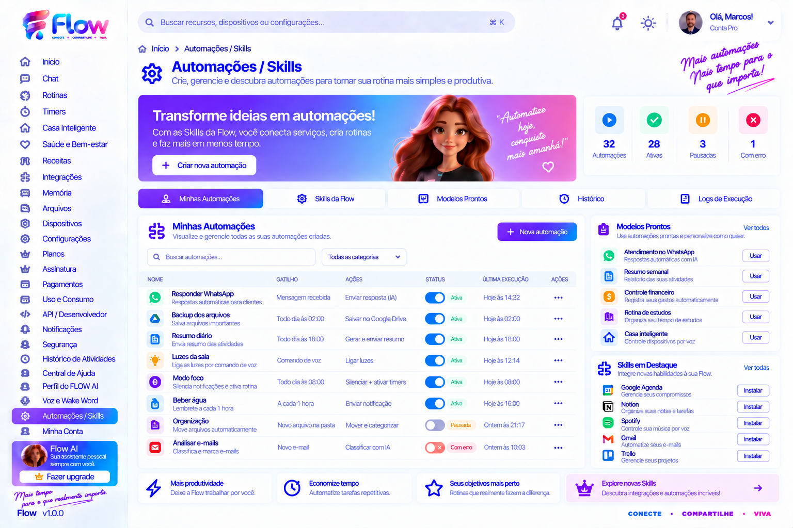

</details>

<details>
<summary><strong>Logs de automação</strong></summary>

**O que esta página faz**

Apresenta o histórico relacionado às execuções das automações.

**Funcionalidades representadas**

- Histórico
- Execuções
- Acompanhamento

**Visual da tela**


</details>

</details>

<details>
<summary><strong>⏱️ Timers</strong> — 3 páginas</summary>

<details>
<summary><strong>Criar timer</strong></summary>

**O que esta página faz**

Permite criar um temporizador para acompanhar uma duração definida pelo usuário.

**Funcionalidades representadas**

- Definição do tempo
- Configuração
- Criação

**Visual da tela**


</details>

<details>
<summary><strong>Timer em execução</strong></summary>

**O que esta página faz**

Acompanha um timer enquanto ele está em contagem.

**Funcionalidades representadas**

- Contagem
- Estado do timer
- Acompanhamento

**Visual da tela**


</details>

<details>
<summary><strong>Timer concluído</strong></summary>

**O que esta página faz**

Apresenta o estado final de um temporizador que terminou.

**Funcionalidades representadas**

- Conclusão
- Estado final
- Resultado

**Visual da tela**


</details>

</details>

<details>
<summary><strong>🏠 Casa inteligente e dispositivos</strong> — 7 páginas</summary>

<details>
<summary><strong>Casa inteligente</strong></summary>

**O que esta página faz**

Apresenta a área de casa inteligente e os ambientes conectados à FLOW.

**Funcionalidades representadas**

- Ambientes
- Dispositivos
- Controle central

**Visual da tela**


</details>

<details>
<summary><strong>Cômodo</strong></summary>

**O que esta página faz**

Detalha um cômodo e os dispositivos associados a ele.

**Funcionalidades representadas**

- Cômodo
- Dispositivos
- Controle

**Visual da tela**


</details>

<details>
<summary><strong>Dispositivo</strong></summary>

**O que esta página faz**

Apresenta informações e controles de um dispositivo conectado.

**Funcionalidades representadas**

- Estado
- Controles
- Informações

**Visual da tela**


</details>

<details>
<summary><strong>Dispositivos</strong></summary>

**O que esta página faz**

Área geral para administrar os dispositivos associados ao usuário.

**Funcionalidades representadas**

- Lista de dispositivos
- Estado
- Gerenciamento

**Visual da tela**

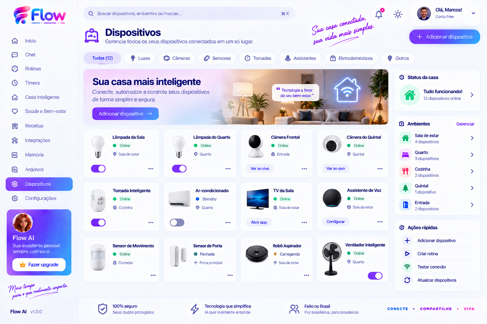

</details>

<details>
<summary><strong>Adicionar dispositivo</strong></summary>

**O que esta página faz**

Inicia o processo de vinculação de um novo dispositivo.

**Funcionalidades representadas**

- Adição
- Configuração
- Vinculação

**Visual da tela**


</details>

<details>
<summary><strong>Detalhes do dispositivo</strong></summary>

**O que esta página faz**

Exibe os detalhes e o estado de um dispositivo específico.

**Funcionalidades representadas**

- Detalhes
- Estado
- Configuração

**Visual da tela**


</details>

<details>
<summary><strong>Editar dispositivo</strong></summary>

**O que esta página faz**

Permite alterar as configurações de um dispositivo já conectado.

**Funcionalidades representadas**

- Edição
- Configuração
- Atualização

**Visual da tela**


</details>

</details>

<details>
<summary><strong>🔌 Integrações</strong> — 3 páginas</summary>

<details>
<summary><strong>Integrações</strong></summary>

**O que esta página faz**

Apresenta a área de integrações disponíveis para ampliar as capacidades da FLOW.

**Funcionalidades representadas**

- Catálogo
- Integrações
- Gerenciamento

**Visual da tela**


</details>

<details>
<summary><strong>Conectar integração</strong></summary>

**O que esta página faz**

Conduz o usuário pelo processo de conexão e autorização de um serviço externo.

**Funcionalidades representadas**

- Conexão
- Autorização
- Permissões

**Visual da tela**


</details>

<details>
<summary><strong>Integração conectada</strong></summary>

**O que esta página faz**

Apresenta uma integração já vinculada e permite administrar sua configuração.

**Funcionalidades representadas**

- Status
- Configuração
- Gerenciamento

**Visual da tela**


</details>

</details>

<details>
<summary><strong>🧠 Memória</strong> — 4 páginas</summary>

<details>
<summary><strong>Memória</strong></summary>

**O que esta página faz**

Área central para visualizar e administrar as informações que a FLOW pode manter como memória.

**Funcionalidades representadas**

- Memórias
- Organização
- Gerenciamento

**Visual da tela**

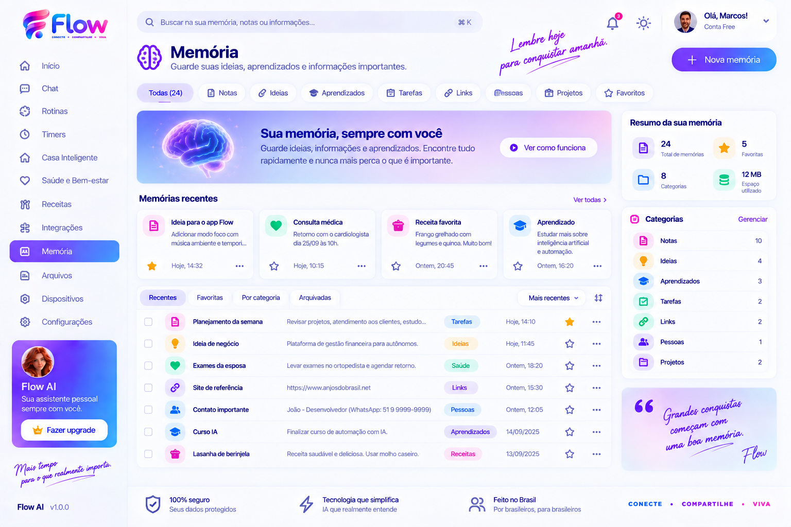

</details>

<details>
<summary><strong>Adicionar informação</strong></summary>

**O que esta página faz**

Adiciona uma nova informação ao sistema de memória.

**Funcionalidades representadas**

- Nova memória
- Conteúdo
- Categoria

**Visual da tela**


</details>

<details>
<summary><strong>Editar informação</strong></summary>

**O que esta página faz**

Atualiza uma informação já armazenada na memória.

**Funcionalidades representadas**

- Edição
- Atualização
- Organização

**Visual da tela**


</details>

<details>
<summary><strong>Detalhes da informação</strong></summary>

**O que esta página faz**

Apresenta uma memória individual e seu contexto.

**Funcionalidades representadas**

- Detalhes
- Contexto
- Gerenciamento

**Visual da tela**


</details>

</details>

<details>
<summary><strong>📁 Arquivos</strong> — 4 páginas</summary>

<details>
<summary><strong>Arquivos</strong></summary>

**O que esta página faz**

Área geral para organizar e acessar arquivos utilizados pela experiência FLOW.

**Funcionalidades representadas**

- Listagem
- Organização
- Acesso

**Visual da tela**

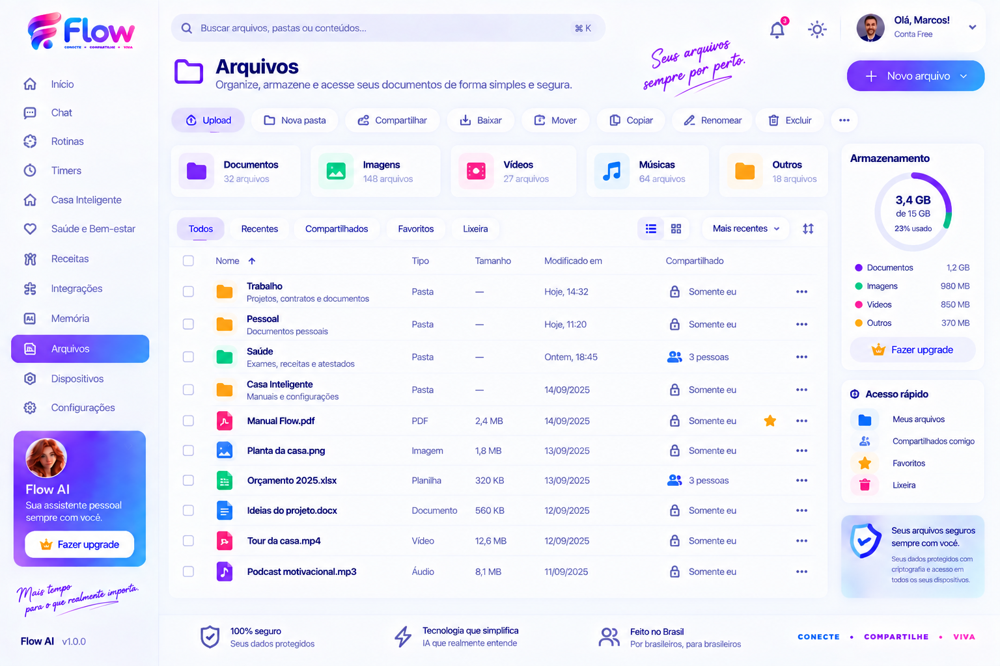

</details>

<details>
<summary><strong>Visualização de arquivo</strong></summary>

**O que esta página faz**

Permite visualizar o conteúdo de um arquivo dentro da plataforma.

**Funcionalidades representadas**

- Visualização
- Conteúdo
- Ações

**Visual da tela**


</details>

<details>
<summary><strong>Detalhes do arquivo</strong></summary>

**O que esta página faz**

Apresenta informações e metadados associados a um arquivo.

**Funcionalidades representadas**

- Detalhes
- Metadados
- Gerenciamento

**Visual da tela**


</details>

<details>
<summary><strong>Upload de arquivos</strong></summary>

**O que esta página faz**

Permite enviar novos arquivos para a plataforma.

**Funcionalidades representadas**

- Seleção
- Upload
- Processamento

**Visual da tela**


</details>

</details>

<details>
<summary><strong>❤️ Saúde e bem-estar</strong> — 2 páginas</summary>

<details>
<summary><strong>Saúde e bem-estar</strong></summary>

**O que esta página faz**

Apresenta a área dedicada à organização e acompanhamento de informações de saúde e bem-estar.

**Funcionalidades representadas**

- Visão geral
- Indicadores
- Acompanhamento

**Visual da tela**


</details>

<details>
<summary><strong>Detalhes de saúde</strong></summary>

**O que esta página faz**

Exibe informações detalhadas de um registro ou indicador de saúde.

**Funcionalidades representadas**

- Detalhes
- Indicadores
- Informações

**Visual da tela**


</details>

</details>

<details>
<summary><strong>🍽️ Receitas e alimentação</strong> — 3 páginas</summary>

<details>
<summary><strong>Receitas</strong></summary>

**O que esta página faz**

Área para descobrir, organizar e acessar receitas dentro da experiência FLOW.

**Funcionalidades representadas**

- Receitas
- Descoberta
- Organização

**Visual da tela**

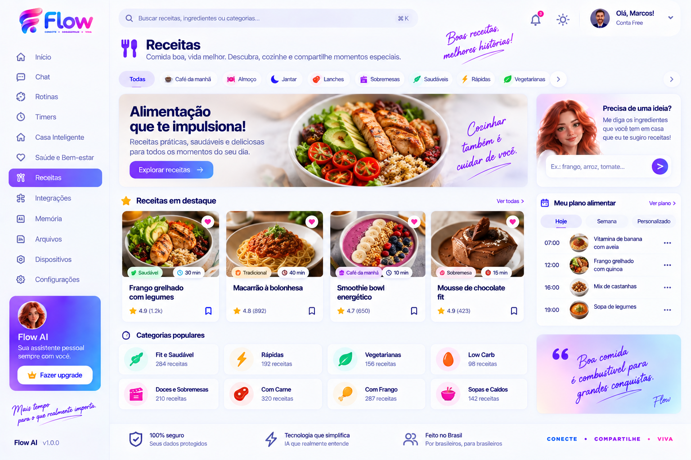

</details>

<details>
<summary><strong>Detalhes da receita</strong></summary>

**O que esta página faz**

Apresenta uma receita individual com seus dados e instruções.

**Funcionalidades representadas**

- Ingredientes
- Modo de preparo
- Informações da receita

**Visual da tela**


</details>

<details>
<summary><strong>Favoritos</strong></summary>

**O que esta página faz**

Reúne as receitas que o usuário marcou para acesso rápido.

**Funcionalidades representadas**

- Favoritos
- Organização
- Acesso rápido

**Visual da tela**


</details>

</details>

<details>
<summary><strong>🎨 Personalização da FLOW</strong> — 6 páginas</summary>

<details>
<summary><strong>Configurar personalidade</strong></summary>

**O que esta página faz**

Define características de personalidade e estilo de interação da FLOW.

**Funcionalidades representadas**

- Personalidade
- Preferências
- Estilo de interação

**Visual da tela**


</details>

<details>
<summary><strong>Configurar comportamento</strong></summary>

**O que esta página faz**

Define regras e preferências para o comportamento da assistente.

**Funcionalidades representadas**

- Comportamento
- Regras
- Preferências

**Visual da tela**


</details>

<details>
<summary><strong>Nível de autonomia</strong></summary>

**O que esta página faz**

Configura o grau de autonomia permitido para a FLOW realizar ações.

**Funcionalidades representadas**

- Autonomia
- Controle de ações
- Preferências

**Visual da tela**


</details>

<details>
<summary><strong>Configurar visão</strong></summary>

**O que esta página faz**

Configura os recursos relacionados à capacidade visual da FLOW.

**Funcionalidades representadas**

- Visão
- Preferências
- Recursos visuais

**Visual da tela**


</details>

<details>
<summary><strong>Configurar voz</strong></summary>

**O que esta página faz**

Configura características da voz e da interação por áudio.

**Funcionalidades representadas**

- Voz
- Preferências
- Configuração

**Visual da tela**


</details>

<details>
<summary><strong>Visão da FLOW</strong></summary>

**O que esta página faz**

Apresenta a experiência/configuração visual relacionada ao recurso de visão da assistente.

**Funcionalidades representadas**

- Visão
- Configuração
- Recursos visuais

**Visual da tela**


</details>

</details>

<details>
<summary><strong>🧩 Skills</strong> — 1 páginas</summary>

<details>
<summary><strong>Marketplace de Skills</strong></summary>

**O que esta página faz**

Permite descobrir capacidades que podem ampliar o conjunto de recursos da FLOW.

**Funcionalidades representadas**

- Marketplace
- Pesquisa
- Descoberta de Skills

**Visual da tela**


</details>

</details>

<details>
<summary><strong>👤 Conta e perfil</strong> — 7 páginas</summary>

<details>
<summary><strong>Minha conta</strong></summary>

**O que esta página faz**

Centraliza informações e configurações pessoais da conta.

**Funcionalidades representadas**

- Conta
- Informações
- Configurações

**Visual da tela**


</details>

<details>
<summary><strong>Perfil</strong></summary>

**O que esta página faz**

Apresenta a área de perfil e os dados associados ao usuário.

**Funcionalidades representadas**

- Perfil
- Informações pessoais
- Configuração

**Visual da tela**

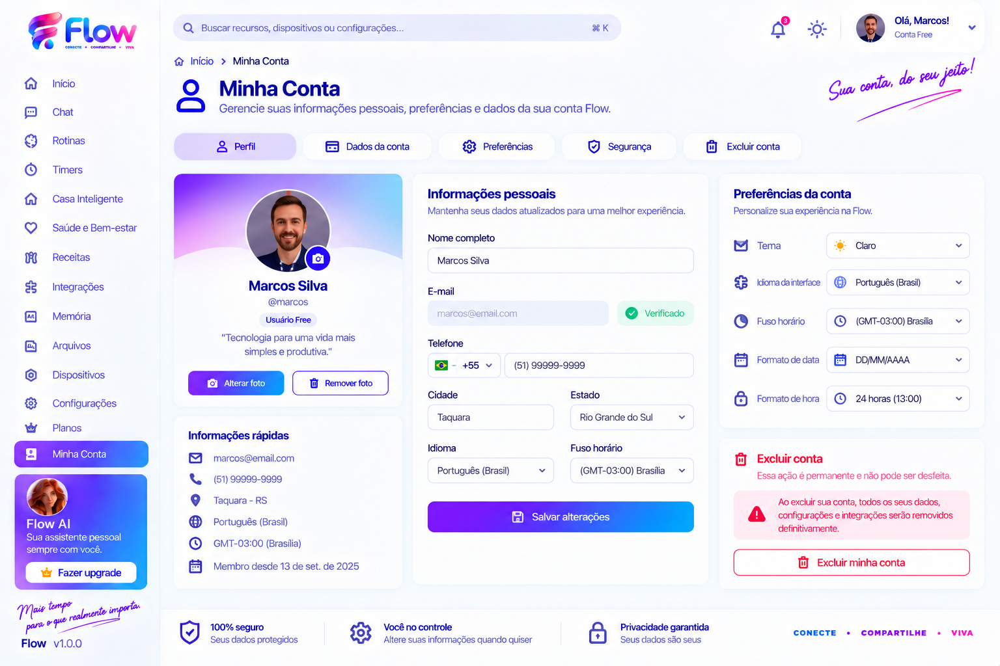

</details>

<details>
<summary><strong>Editar informações pessoais</strong></summary>

**O que esta página faz**

Permite atualizar informações pessoais do perfil.

**Funcionalidades representadas**

- Edição
- Dados pessoais
- Atualização

**Visual da tela**


</details>

<details>
<summary><strong>Preferências da conta</strong></summary>

**O que esta página faz**

Centraliza preferências gerais da experiência da conta.

**Funcionalidades representadas**

- Preferências
- Configuração
- Personalização

**Visual da tela**


</details>

<details>
<summary><strong>Configurações</strong></summary>

**O que esta página faz**

Centraliza configurações gerais da experiência FLOW.

**Funcionalidades representadas**

- Configurações
- Preferências
- Gerenciamento

**Visual da tela**


</details>

<details>
<summary><strong>Uso e consumo</strong></summary>

**O que esta página faz**

Acompanha o uso de recursos associado à conta.

**Funcionalidades representadas**

- Uso
- Consumo
- Acompanhamento

**Visual da tela**


</details>

<details>
<summary><strong>Histórico de atividades</strong></summary>

**O que esta página faz**

Apresenta atividades registradas para acompanhamento da conta.

**Funcionalidades representadas**

- Histórico
- Atividades
- Auditoria

**Visual da tela**


</details>

</details>

<details>
<summary><strong>🔒 Segurança</strong> — 9 páginas</summary>

<details>
<summary><strong>Central de segurança</strong></summary>

**O que esta página faz**

Área central para administrar recursos de proteção e segurança da conta.

**Funcionalidades representadas**

- Segurança
- Controles
- Configurações

**Visual da tela**

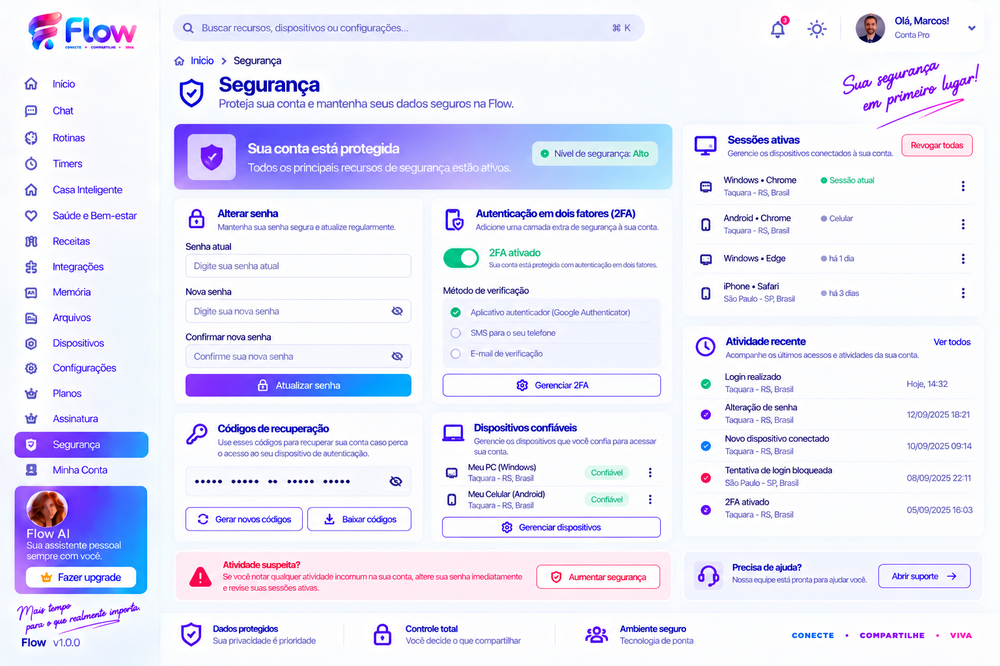

</details>

<details>
<summary><strong>Segurança da conta</strong></summary>

**O que esta página faz**

Concentra controles relacionados à proteção da conta e das credenciais.

**Funcionalidades representadas**

- Segurança
- Credenciais
- Proteção

**Visual da tela**


</details>

<details>
<summary><strong>Verificação em duas etapas (2FA)</strong></summary>

**O que esta página faz**

Configura e administra a autenticação em dois fatores.

**Funcionalidades representadas**

- 2FA
- Autenticação
- Proteção da conta

**Visual da tela**


</details>

<details>
<summary><strong>Dispositivos conectados e sessões ativas</strong></summary>

**O que esta página faz**

Permite acompanhar onde a conta está conectada e quais sessões estão ativas.

**Funcionalidades representadas**

- Dispositivos
- Sessões
- Controle de acesso

**Visual da tela**


</details>

<details>
<summary><strong>Sessões ativas</strong></summary>

**O que esta página faz**

Lista as sessões abertas para acompanhamento e gerenciamento.

**Funcionalidades representadas**

- Sessões
- Encerramento
- Controle de acesso

**Visual da tela**


</details>

<details>
<summary><strong>Atividade de login</strong></summary>

**O que esta página faz**

Exibe acessos e atividades recentes de login.

**Funcionalidades representadas**

- Logins recentes
- Atividade
- Auditoria

**Visual da tela**


</details>

<details>
<summary><strong>Alertas de segurança</strong></summary>

**O que esta página faz**

Centraliza alertas relacionados a eventos de segurança.

**Funcionalidades representadas**

- Alertas
- Eventos de segurança
- Acompanhamento

**Visual da tela**


</details>

<details>
<summary><strong>Recuperação de conta e códigos</strong></summary>

**O que esta página faz**

Apresenta recursos para recuperação segura da conta.

**Funcionalidades representadas**

- Recuperação
- Códigos
- Segurança

**Visual da tela**


</details>

<details>
<summary><strong>Permissões</strong></summary>

**O que esta página faz**

Apresenta o gerenciamento geral de permissões associadas à experiência.

**Funcionalidades representadas**

- Permissões
- Acessos
- Controle

**Visual da tela**

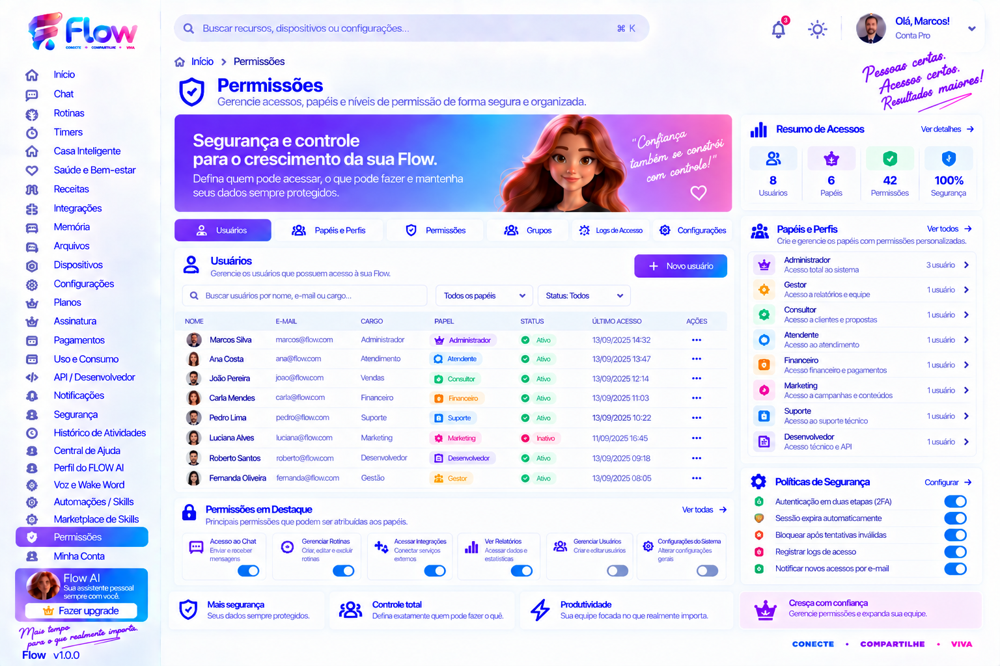

</details>

</details>

<details>
<summary><strong>🛡️ Privacidade e dados</strong> — 6 páginas</summary>

<details>
<summary><strong>Privacidade e dados</strong></summary>

**O que esta página faz**

Centraliza controles relacionados à privacidade e ao tratamento dos dados do usuário.

**Funcionalidades representadas**

- Privacidade
- Dados
- Controles

**Visual da tela**


</details>

<details>
<summary><strong>Central de dados e privacidade</strong></summary>

**O que esta página faz**

Organiza os controles de dados mantidos e utilizados pela FLOW.

**Funcionalidades representadas**

- Dados
- Privacidade
- Gerenciamento

**Visual da tela**


</details>

<details>
<summary><strong>Permissões da FLOW</strong></summary>

**O que esta página faz**

Gerencia permissões concedidas especificamente à FLOW.

**Funcionalidades representadas**

- Permissões
- Acessos
- Controle

**Visual da tela**


</details>

<details>
<summary><strong>Histórico de permissões</strong></summary>

**O que esta página faz**

Apresenta o histórico das permissões concedidas ou alteradas.

**Funcionalidades representadas**

- Histórico
- Permissões
- Auditoria

**Visual da tela**


</details>

<details>
<summary><strong>Exportar meus dados</strong></summary>

**O que esta página faz**

Permite iniciar o fluxo de exportação dos dados associados à conta.

**Funcionalidades representadas**

- Exportação
- Dados da conta
- Privacidade

**Visual da tela**


</details>

<details>
<summary><strong>Solicitar exclusão da conta e dos dados</strong></summary>

**O que esta página faz**

Inicia o fluxo para solicitar a exclusão da conta e dos dados associados.

**Funcionalidades representadas**

- Exclusão
- Dados
- Confirmação

**Visual da tela**


</details>

</details>

<details>
<summary><strong>💳 Planos e assinatura</strong> — 4 páginas</summary>

<details>
<summary><strong>Planos</strong></summary>

**O que esta página faz**

Apresenta as opções de planos disponíveis para a experiência FLOW.

**Funcionalidades representadas**

- Planos
- Opções
- Escolha

**Visual da tela**

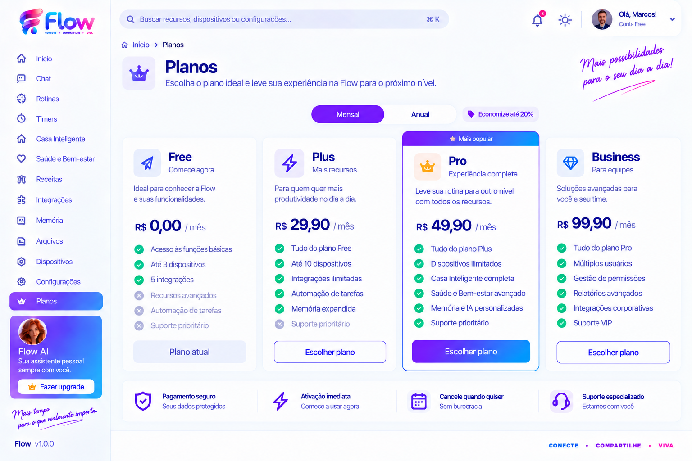

</details>

<details>
<summary><strong>Planos e assinatura</strong></summary>

**O que esta página faz**

Apresenta o relacionamento entre os planos e a assinatura atual.

**Funcionalidades representadas**

- Planos
- Comparação
- Assinatura

**Visual da tela**


</details>

<details>
<summary><strong>Assinatura</strong></summary>

**O que esta página faz**

Apresenta informações sobre o estado da assinatura da conta.

**Funcionalidades representadas**

- Plano atual
- Status
- Informações

**Visual da tela**

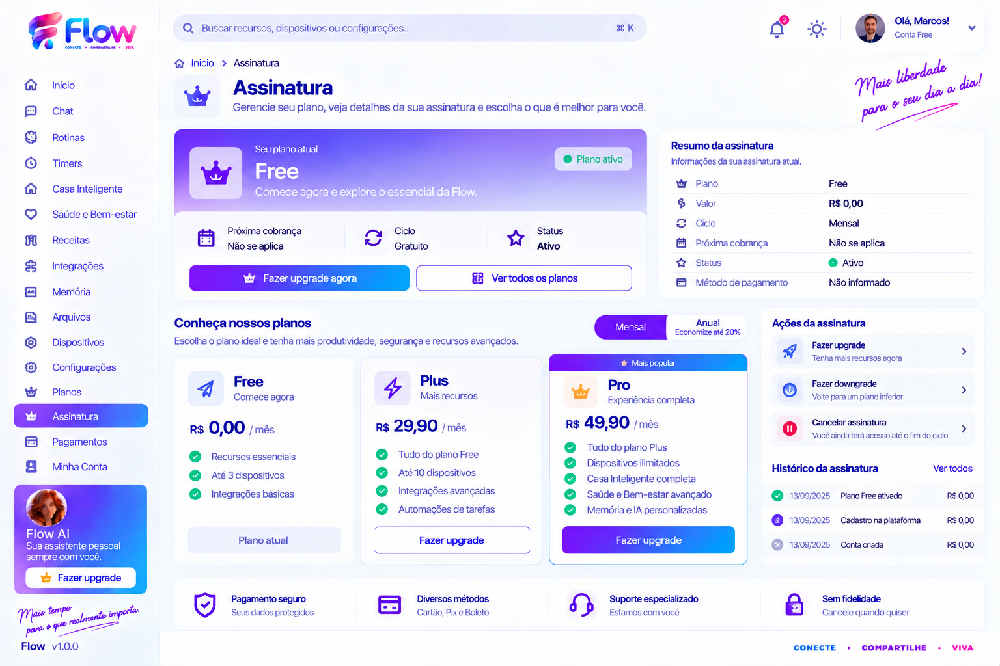

</details>

<details>
<summary><strong>Gerenciar assinatura</strong></summary>

**O que esta página faz**

Permite administrar alterações relacionadas à assinatura.

**Funcionalidades representadas**

- Gerenciamento
- Alterações
- Assinatura

**Visual da tela**


</details>

</details>

<details>
<summary><strong>💰 Pagamentos</strong> — 5 páginas</summary>

<details>
<summary><strong>Formas de pagamento</strong></summary>

**O que esta página faz**

Gerencia as formas de pagamento cadastradas para a conta.

**Funcionalidades representadas**

- Métodos de pagamento
- Gerenciamento
- Atualização

**Visual da tela**


</details>

<details>
<summary><strong>Faturamento</strong></summary>

**O que esta página faz**

Apresenta informações relacionadas ao faturamento da conta.

**Funcionalidades representadas**

- Faturamento
- Cobranças
- Informações

**Visual da tela**

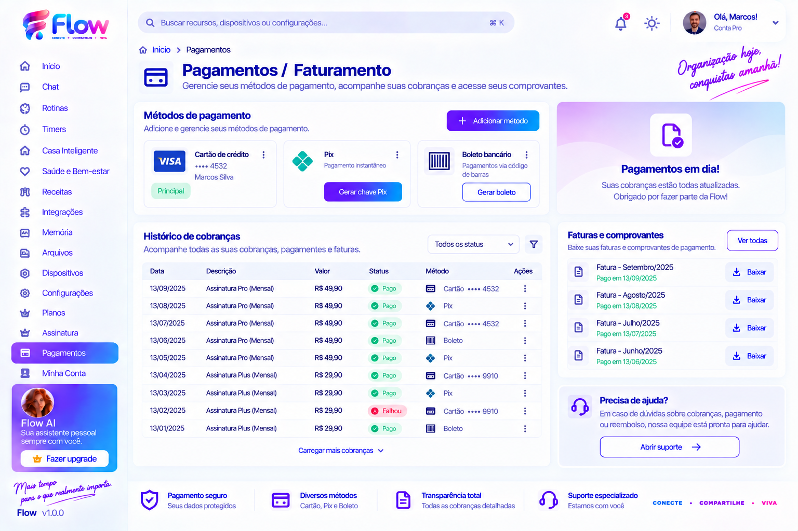

</details>

<details>
<summary><strong>Checkout</strong></summary>

**O que esta página faz**

Representa um fluxo de checkout estruturado em etapas para concluir uma operação de pagamento.

**Funcionalidades representadas**

- Checkout
- Confirmação
- Conclusão

**Visual da tela**

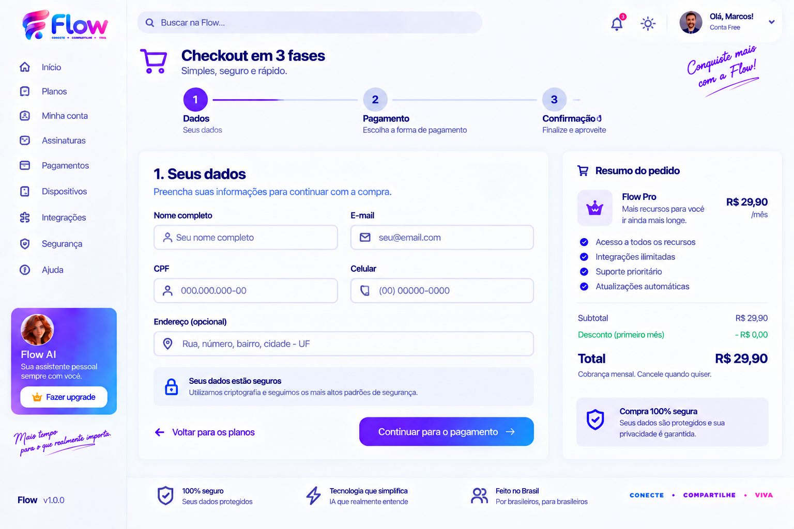

</details>

<details>
<summary><strong>Histórico de pagamentos e notas fiscais</strong></summary>

**O que esta página faz**

Permite consultar pagamentos anteriores e documentos fiscais.

**Funcionalidades representadas**

- Histórico
- Pagamentos
- Notas fiscais

**Visual da tela**


</details>

<details>
<summary><strong>Uso e consumo</strong></summary>

**O que esta página faz**

Acompanha o consumo de recursos relacionado ao uso da plataforma.

**Funcionalidades representadas**

- Consumo
- Uso
- Acompanhamento

**Visual da tela**


</details>

</details>

<details>
<summary><strong>🛠️ API e Developer</strong> — 10 páginas</summary>

<details>
<summary><strong>API / Desenvolvedor</strong></summary>

**O que esta página faz**

Apresenta a área de desenvolvimento e integração programática da FLOW.

**Funcionalidades representadas**

- Visão geral
- Recursos de desenvolvimento
- Integração por API

**Visual da tela**


</details>

<details>
<summary><strong>Chaves de API</strong></summary>

**O que esta página faz**

Gerencia credenciais utilizadas para acesso programático à API.

**Funcionalidades representadas**

- Criação e gerenciamento de chaves
- Credenciais
- Revogação

**Visual da tela**


</details>

<details>
<summary><strong>Documentação da API</strong></summary>

**O que esta página faz**

Centraliza a documentação necessária para integrar aplicações à API da FLOW.

**Funcionalidades representadas**

- Documentação
- Referência técnica
- Integração

**Visual da tela**


</details>

<details>
<summary><strong>Endpoints da API</strong></summary>

**O que esta página faz**

Apresenta os endpoints disponíveis para integração.

**Funcionalidades representadas**

- Endpoints
- Operações
- Referência

**Visual da tela**


</details>

<details>
<summary><strong>Webhooks</strong></summary>

**O que esta página faz**

Configura recursos de webhook para receber eventos da plataforma.

**Funcionalidades representadas**

- Webhooks
- Eventos
- Integrações

**Visual da tela**

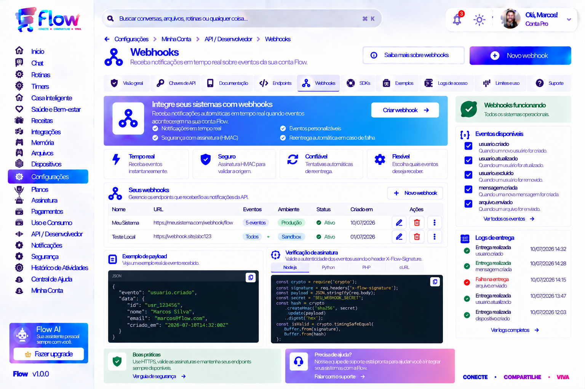

</details>

<details>
<summary><strong>SDKs e bibliotecas</strong></summary>

**O que esta página faz**

Apresenta SDKs e bibliotecas destinadas à integração com a FLOW.

**Funcionalidades representadas**

- SDKs
- Bibliotecas
- Integração

**Visual da tela**


</details>

<details>
<summary><strong>Exemplos de código</strong></summary>

**O que esta página faz**

Disponibiliza exemplos para acelerar o desenvolvimento de integrações.

**Funcionalidades representadas**

- Exemplos
- Código
- Integração

**Visual da tela**


</details>

<details>
<summary><strong>Logs de acesso da API</strong></summary>

**O que esta página faz**

Acompanha acessos e chamadas realizadas na API.

**Funcionalidades representadas**

- Logs
- Acessos
- Auditoria

**Visual da tela**


</details>

<details>
<summary><strong>Limites de uso da API</strong></summary>

**O que esta página faz**

Apresenta limites e informações de utilização da API.

**Funcionalidades representadas**

- Limites
- Consumo
- Uso

**Visual da tela**


</details>

<details>
<summary><strong>Suporte do desenvolvedor</strong></summary>

**O que esta página faz**

Centraliza suporte e orientação para integrações e desenvolvimento com a API.

**Funcionalidades representadas**

- Suporte
- API
- Desenvolvimento

**Visual da tela**


</details>

</details>

<details>
<summary><strong>🔔 Notificações e suporte</strong> — 2 páginas</summary>

<details>
<summary><strong>Notificações</strong></summary>

**O que esta página faz**

Centraliza notificações e eventos relevantes para o usuário.

**Funcionalidades representadas**

- Notificações
- Eventos
- Acesso rápido

**Visual da tela**

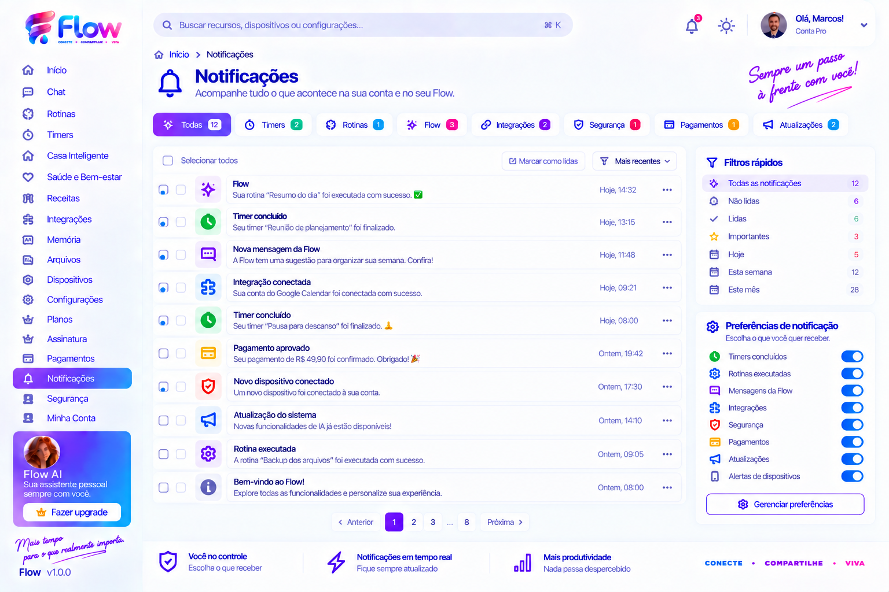

</details>

<details>
<summary><strong>Central de ajuda</strong></summary>

**O que esta página faz**

Oferece acesso à área de ajuda e orientação da plataforma.

**Funcionalidades representadas**

- Ajuda
- Pesquisa
- Orientação

**Visual da tela**


</details>

</details>

---

## 🏗️ Arquitetura

```text
Interface
   ↓
Application / Use Case
   ↓
Domain
   ↓
Infrastructure
   ↓
Database / External Services
```

A FLOW separa inteligência de execução. O modelo interpreta e pode planejar; a camada de aplicação deve validar permissões, argumentos, políticas e contratos antes de executar ações.

### Fluxo operacional

```text
LER
 ↓
INSPECIONAR
 ↓
LOCALIZAR
 ↓
PLANEJAR
 ↓
EXECUTAR
 ↓
TESTAR
 ↓
AUDITAR
 ↓
DOCUMENTAR
```

---

## 🧰 Stack

### Frontend

React, TypeScript, Next.js/Vite conforme o módulo existente, Tailwind CSS, Lucide, Framer Motion, Zustand, React Hook Form, Zod e React Query.

### Backend e infraestrutura

Node.js para serviços de aplicação, Python para serviços especializados de IA/voz/visão, APIs HTTP, WebSockets quando necessários, PostgreSQL e Redis quando aplicável.

### Inteligência

Modelos locais e/ou externos, Ollama, NVIDIA NIM quando disponível, Vision, Speech-to-Text, Text-to-Speech, tool calling e orquestração de agentes.

---

## 🔐 Segurança e permissões

A segurança é transversal ao produto. Os princípios incluem menor privilégio, autenticação, autorização no backend, isolamento de dados, secrets fora do código, validação de entrada, auditoria, expiração de sessão, revogação e logs.

### Regra crítica

```text
MODELO ≠ AUTORIDADE
```

Ocultar uma área no frontend não substitui autorização no backend. Operações que produzem efeitos externos devem passar pelos controles de permissão aplicáveis.

---

## 🧪 Testes e validação

A definição de pronto segue: 

```text
IMPLEMENTAR → INTEGRAR → TESTAR → VALIDAR → AUDITAR → DOCUMENTAR
```

Checklist operacional:

- [ ] Build sem erros
- [ ] Backend inicia
- [ ] Frontend inicia
- [ ] Banco disponível
- [ ] Autenticação validada
- [ ] Rotas principais funcionando
- [ ] APIs validadas
- [ ] Sem erros críticos no console
- [ ] Sem endpoints fake
- [ ] Sem dados fake em fluxos reais
- [ ] Permissões verificadas
- [ ] Responsividade validada
- [ ] Fluxos críticos testados

---

## 📊 Estado do produto

O inventário consolidado do produto diferencia **páginas, telas, estados, modais, fluxos e componentes**. Uma única rota pode possuir vários estados visuais; por isso, quantidade de telas não deve ser interpretada automaticamente como quantidade de URLs.

Para o portfólio, esta galeria adota um critério mais simples: **mostrar as telas que possuem representação visual identificável no material do projeto**.

---

## 🧭 Desenvolvimento

Antes de criar ou alterar uma funcionalidade:

```text
LER
→ INSPECIONAR
→ LOCALIZAR
→ PLANEJAR
→ EXECUTAR
→ TESTAR
```

Não duplicar uma implementação existente sem verificar sua reutilização. Não inventar endpoints, arquivos, credenciais, resultados de testes ou integrações.

Commits seguem Conventional Commits:

```text
feat: adiciona memória persistente
fix: corrige fluxo de autenticação
refactor: separa serviço de integrações
test: adiciona testes do chat
docs: atualiza documentação
chore: atualiza configuração
```

---

## 📚 Documentação

A documentação complementar fica em `docs/`, incluindo especificações de arquitetura, contratos, inventários e regras de implementação do projeto.

---

## 👨‍💻 Autor

**Vini Amaral**  
Construção e desenvolvimento da **FLOW AI**

**Flow Serviços Online Ltda.**

---

<div align="center">

### FLOW AI

**Conecte • Compartilhe • Viva**

</div>
